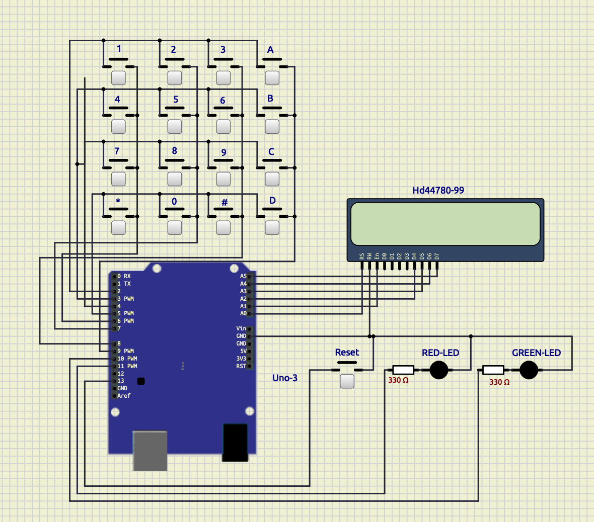

# 🔐 Secure Door Access System (Arduino + SimulIDE)

> A simulated embedded system using a 4x4 keypad, LCD display, and LED indicators to validate password entry and lock/unlock access based on user input.

---

## 📜 Overview

This project simulates a **secure door access system** built using Arduino Uno and tested entirely in **SimulIDE**. Users enter a 4-digit password using a **4x4 keypad**, and feedback is shown on a **16x2 LCD screen**. After 3 incorrect attempts, the system locks out and can only be reset using a **reset button**.

---

## 🎯 Features

- ✅ 4-digit password entry
- ✅ Masked LCD input (with `*`)
- ✅ 3-attempt limit with lockout
- ✅ Visual feedback using LEDs
- ✅ Manual reset via push button
- ✅ Fully simulated (no physical hardware needed)

---

## 🧰 Components Used (SimulIDE)

| Component            | Label in SimulIDE          | Purpose                          |
|----------------------|-----------------------------|----------------------------------|
| Arduino Uno          | `Arduino Uno`               | Main controller                  |
| 4x4 Keypad           | `Push Button` (16x)         | User input for password          |
| LCD Display (16x2)   | `LCD 16x2`                  | Displays prompts and feedback    |
| Green LED            | `Led` (color: green)        | Access granted indicator         |
| Red LED              | `Led` (color: red)          | Access denied/locked indicator   |
| Reset Button         | `Push Button`               | Resets system after lockout      |
| Resistors (optional) | `Resistor` (220Ω, x2)       | For LEDs (optional in simulation)
| Wires                | `Wire`                      | Connecting components            |

---

## 🔧 Pin Configuration

| Arduino Pin | Connected To           | Description              |
|-------------|------------------------|--------------------------|
| D2–D5       | Keypad Rows (left legs)  | Row lines                |
| D6–D9       | Keypad Columns (right legs) | Column lines         |
| A0–A5       | LCD RS, E, D4–D7        | 4-bit LCD communication  |
| D10         | Green LED               | Access granted indicator |
| D11         | Red LED                 | Access denied/locked     |
| D13         | Reset Button (INPUT_PULLUP) | Manual reset input   |

---

## 💻 Code Behavior

- User enters 4-digit password
- LCD masks input with `*`
- If correct: Green LED lights, "Access Granted"
- If incorrect: Red LED flashes, attempts increment
- After 3 failed attempts: lockout activates, "No more attempts"
- Pressing reset button resets the system

---

## 🧪 Simulation Instructions

1. Open the circuit in **SimulIDE**
2. Load the compiled `.hex` from PlatformIO into the Arduino Uno
3. Press ▶️ to start the simulation
4. Use keypad to test password entry
5. Watch Serial Monitor and LCD for output

---

## ✅ Default Password

- Current: 1234
- Change inside main.cpp char password[] = "";

